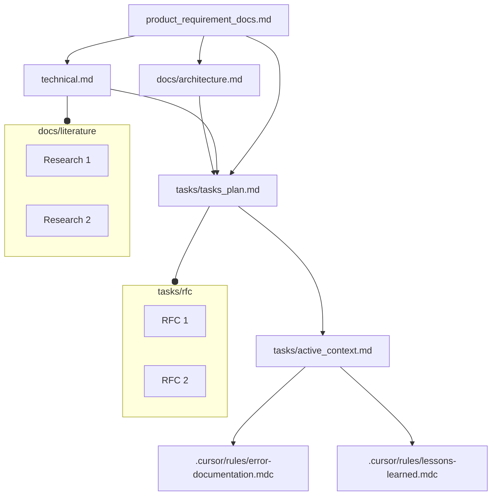

# Light-Spec Pack

## Overview

The `light-spec` pack transforms your AI assistant into a junior software developer that deeply understands your project. By leveraging established software engineering principles and a structured documentation system, this pack ensures your AI assistants (like Cursor, CLINE, RooCode, Windsurf, and Github Copilot) operate consistently, understand your project's architecture, and follow optimal workflows.

### Why Use This Pack?

In modern software development, AI assistants often lack the context to perform beyond simple, one-shot tasks. They don't understand your project's history, its architectural decisions, or your team's conventions. This pack solves that by creating a "second brain" for your AI, enabling it to act as a true partner in building sophisticated applications.

### Who Is This For?

*   **Individual Developers & Small Teams:** Build complex projects with the discipline of a large, well-organized team.
*   **AI-Forward Engineers:** Get the most out of your AI tools by providing them with the structure they need to excel.
*   **Prototypers & Innovators:** Move beyond simple scripts and build robust, well-documented applications from day one.

### Key Features

*   **Structured Memory:** A dedicated `memory/` directory provides your AI with long-term, context-rich knowledge about your project (PRDs, architecture, tasks).
*   **Systematic Workflows:** Pre-defined rules for planning, implementation, and debugging ensure consistent, high-quality output.
*   **Cross-Platform Compatibility:** Write rules once and use them across multiple AI coding assistants. The `rulebook-ai` tool handles the translation.
*   **Reduced Setup Time:** The pack provides a ready-to-use structure, including tool starters and documentation templates, so you can get started quickly.
*   **Extensible Tooling:** A `tools/` directory with its own environment setup allows you to add custom scripts and capabilities that your AI can leverage.

Light-Spec is the most concise ruleset in the Rulebook-AI collection. It focuses on core principles and assumes a highly capable AI model paired with an experienced team. Use it when speed and flexibility are more important than exhaustive guardrails.

## When to Choose Light-Spec

- Teams already comfortable directing and validating AI assistants.
- Projects using advanced models that can infer details from principles.
- Rapid prototyping or smaller stories where minimal overhead is preferred.
- Workflows with close human oversight to catch misinterpretations.

If you need more structure or checks, consider the `medium-spec` or `heavy-spec` packs.

## Pack Structure

- `rules/`: core instruction files such as `00-meta-rules.md`, `06-rules_v1.md`, and workflow guides for planning, coding, and debugging.
- `memory_starters/`: starter documents that seed the persistent project memory bank.
- `tool_starters/`: helper scripts or configurations copied into your project.

## Installation & Usage

```bash
# Add this built-in pack to your project's library
uvx rulebook-ai packs add light-spec --project-dir /path/to/your/project

# Apply the pack and generate assistant-specific rule files
uvx rulebook-ai project sync --assistant cursor --project-dir /path/to/your/project
```

Add `memory/`, `tools/`, `env.example`, and `requirements.txt` to version control. Framework state in `.rulebook-ai/` and generated rule directories (e.g., `.cursor/`, `.clinerules/`, `.roo/`) should go in `.gitignore`.

## Tooling Environment Setup

The `light-spec` pack includes a `tool_starters/` directory that gets copied into your project's `tools/` directory. These are Python scripts that your AI assistant can be instructed to use for tasks like web scraping or searching. To make them work, you need to set up their environment.

1.  **Navigate to the `tools` directory:**
    ```bash
    cd /path/to/your/project/tools
    ```

2.  **Create and activate a virtual environment:**
    This isolates the tools' dependencies from your main project.
    ```bash
    python -m venv .venv
    source .venv/bin/activate
    ```

3.  **Install dependencies:**
    The required Python packages are listed in `requirements.txt`.
    ```bash
    pip install -r requirements.txt
    ```

4.  **Configure Environment Variables:**
    Some tools may require API keys or other secrets.
    -   Copy the example environment file: `cp .env.example .env`
    -   Edit the `.env` file and add your secrets (e.g., `OPENAI_API_KEY=...`).
    -   The scripts in `tools/` are pre-configured to load variables from this `.env` file.

Your AI can now be instructed to run these tools to perform tasks, and they will have the necessary environment and dependencies.

## Core Philosophy and File Structure

This pack is built on the idea that an AI assistant's behavior can be guided by a combination of procedural rules and contextual memory, rooted in established software engineering practices.

- **Rule Files (`plan.md`, `implement.md`, `debug.md`):** These files define *how* the AI should approach tasks. They dictate specific, systematic workflows for planning, coding, and debugging.
  - **`plan`**: Defines a workflow for planning based on *chain of thought*, including exhaustive searching, rigorous reasoning, and user validation.
  - **`implement`**: Defines a workflow for implementation inspired by concepts like separation of concerns, modular design, and incremental development, with mandatory testing.
  - **`debug`**: Defines rules for debugging, including using web search for previously solved errors.

- **Memory Files (`memory/`):** These files provide the AI with *what* it needs to know—the persistent, structured knowledge about your specific project, including requirements, architecture, and tasks. This forms the AI's long-term project "memory." For a deeper dive into the theory behind these software documents, see the [Software Documentation Guides](../../../../../memory/docs/user_guide/software_documentation_guides.md).

- **Directory Structure Rule:** A rule is included to encourage a clear and modular project directory structure, promoting separation of concerns (e.g., `src/`, `tests/`, `config/`).

### Assistant-Specific Rule Generation

The `project sync` command processes these core ideas and generates the appropriate files for different AI assistants. For example:

- **Cursor:** Generates individual `.mdc` files in `.cursor/rules/`.
- **RooCode:** Generates mode-specific rules in directories like `.roo/rules-architect/` and `.roo/rules-code/`.
- **Windsurf:** Generates individual `.md` rule files in `.windsurf/rules/`.
- **Single-File Assistants (Warp, GitHub Copilot, etc.):** Concatenates all rules into a single file.

## Key Concepts & Prompting Tips

- **`.rulebook-ai/`** – internal framework state. After `project sync`, local copies of pack rules live in `.rulebook-ai/packs/` and are regenerated as needed.
- **`memory/`** – persistent, user-owned documents (PRD, architecture, technical specs, task plans) that the AI can read and update.
- **File references** – point your assistant at files using its reference syntax (e.g., `@memory/docs/product_requirement_docs.md`).

### Prompt Patterns

- **Planning** – ask the AI to update tasks or docs.  
  _Example:_ "Add a 'Refactor Auth' task to @memory/tasks/tasks_plan.md with a short description."
- **Context lookup** – query the AI about project decisions or status.  
  _Example:_ "What database did we choose in @memory/docs/architecture.md?"
- **Implementation guidance** – request code while referencing rules and memory.
  _Example:_ "Follow @.rulebook-ai/packs/light-spec/rules/03-rules-code/01-code_v1.md to build the login flow described in @memory/tasks/active_context.md."

## Plan/Implement/Debug: Systematic Workflow for Tasks

The rule files cached in `.rulebook-ai/packs/light-spec/rules/` define a structured workflow for approaching any development task, regardless of granularity. This workflow is based on standard software engineering best practices and promotes a systematic approach to problem-solving.

## Five-Phased Workflow

Light-Spec encodes a five-phased approach to software development. The phases correspond to the planning, coding, and debugging rules in `rules/02-rules-architect`, `rules/03-rules-code`, and `rules/04-rules-debug`.

**(i) Requirements and Clarifications:**

   it starts with making the requirements very clear and asking as much clarification as possible in the beginning. This is always the first task software development. Where all the requirements are made as precise and verbose as possible so as to save Time and effort later in redoing. Plus anticipate Major bottlenecks ahead of any work.

**(ii) Exhaustive Searching and Optimal Plan:**
  exhaustive searching and optimal plan: search all possible directions in which the problem can be solved. And find out the optimal solution, which can be also a amalgamation of many different approaches. And reason rigourously, why the chosen approach is optimal.

**(iii) User Validation:**

  validate the developed optimal plan with the user clearly stating the assumptions and design decisions made, and the reasons for them.

**(iv) Implementation:**

   implement proposed plan in an iterative way, taking one functionality at a time, testing it exhaustively with all the cases. And then building the next functionality. In this way to make the system, robust and incremental.

**(v) Further Suggestions:**

   after implementation, suggesting possible optimisation to be done or possible, additional features for security or functionality to be added.

So this five phased approach, is for a software life-cycle. But this can be applied for any grnuarlity, like entire project or a single functionality. For example, very clearly recording the requirement for the functionality and asking clarifying questions is as good for a single small functionality as for a program. So this five phased, solution strategy workflow is to be followed at every part of development.

## Leveraging Your AI's Enhanced Brain: Example Interactions

Once Rulebook-AI is set up with a chosen pack (cached under `.rulebook-ai/`) and the memory bank (in `memory/`), you can interact with your AI coding assistant much more effectively. Here are a few crucial examples of how to leverage this enhanced context and guidance. Remember to use your AI assistant's specific syntax for referencing files (e.g., `@filename` in Cursor or Copilot).

1.  **Maintain Project Structure & Planning:**
    *   **Goal:** Use the AI to help keep your project documentation and task lists up-to-date.
    *   **Example Prompt (in your AI chat):**
        ```
        Based on section 3.2 of @memory/docs/product_requirement_docs.md, create three new tasks in @memory/tasks/tasks_plan.md for the upcoming 'User Profile Redesign' feature. For each task, include a brief description, assign it a unique ID, and estimate its priority (High/Medium/Low).
        ```
    *   **Why this is important:** This demonstrates the AI actively participating in project management by updating the "memory bank" itself. It ensures your planning documents stay synchronized with insights derived from foundational requirements, turning the AI into a proactive assistant beyond just code generation.
2.  **Retrieve Context-Specific Information Instantly:**
    *   **Goal:** Quickly access key project details without manually searching through documents.
    *   **Example Prompt (in your AI chat):**
        ```
        What is the current status of task 'API-003' as listed in @memory/tasks/tasks_plan.md? Also, remind me which database technology we decided on according to @memory/docs/architecture.md.
        ```
    *   **Why this is important:** This highlights the power of the "persistent memory bank." The AI acts as a knowledgeable team member, capable of quickly recalling specific project decisions, technical details, and task statuses, significantly improving your workflow efficiency.
3.  **Implement Features with Deep Context & Guided Workflow:**
    *   **Goal:** Guide the AI to develop code by following defined procedures and referencing precise project context.
    *   **Example Prompt (in your AI chat):**
        ```
        Using the workflow defined in @.rulebook-ai/packs/light-spec/rules/03-rules-code/01-code_v1.md, please develop the `updateUserProfile` function. The detailed requirements for this function are specified under the 'User Profile Update' task in @memory/tasks/active_context.md. Ensure the implementation aligns with the API design guidelines found in @memory/docs/technical.md.
        ```
    *   **Why this is important:** This is the core development loop where Rulebook-AI shines. It shows the AI leveraging both the *procedural rules* (how to approach implementation, from `.rulebook-ai/packs/`) and the rich *contextual memory* (what to implement and its surrounding technical landscape, from `memory/`). This leads to more accurate, consistent, and context-aware code generation, reducing rework and improving quality.

These examples illustrate how providing structured rules and a persistent memory bank allows for more sophisticated and productive interactions with your AI coding assistant. Experiment with referencing different files from your `.rulebook-ai/packs/` and `memory/` directories to best suit your workflow.

## Memory: Persistent Project Documentation

The `memory` files (located in `clinerules/memory` and `cursor/rules/memory.mdc`) establish a robust documentation system that serves as persistent memory for the project and the AI assistant. This system is inspired by standard software development documentation practices, including PRDs, architecture plans, technical specifications, and RFCs. So, keeping these software life-cycle documentation is as focus. We develop our memory bank to have these document in sync to provide the complete context for the project. We have few additional files for current context and task plan in tasks/.

**Memory Files Structure:**

The memory system is structured into Core Files (required) and Context Files (optional), forming a hierarchical knowledge base for the project.


**Core Files (Required):**

1.  **`product_requirement_docs.md` (docs/product_requirement_docs.md):** Product Requirement Document (PRD) or Standard Operating Procedure (SOP).
    - Defines the project's purpose, problems it solves, core requirements, and goals.
    - Serves as the foundational document and source of truth for project scope.

    Product Requirement Documents (PRDs) are foundational blueprints in software development, defining what a product should achieve and guiding teams to align on scope, features, and objectives .

2.  **`architecture.md` (docs/architecture.md):** System Architecture Document.
    - Outlines the system's design, component relationships, and dependencies.

    Software architecture documentation is a blueprint that captures design decisions, component interactions, and non-functional requirements.

3.  **`technical.md` (docs/technical.md):** Technical Specifications Document.
    - Details the development environment, technologies used, key technical decisions, design patterns, and technical constraints.

4.  **`tasks_plan.md` (tasks/tasks_plan.md):** Task Backlog and Project Progress Tracker.
    - Provides an in-depth list of tasks, tracks project progress, current status, and known issues.

5.  **`active_context.md` (tasks/active_context.md):** Active Development Context.
    - Captures the current focus of development, active decisions, recent changes, and next steps.

6.  **`error-documentation.mdc` (.cursor/rules/error-documentation.mdc):** Error Documentation.
    - Documents reusable fixes for mistakes and corrections, serving as a knowledge base of known issues and resolutions.

7.  **`lessons-learned.mdc` (.cursor/rules/lessons-learned.mdc):** Lessons Learned Journal.
    - A project-specific learning journal that captures patterns, preferences, and project intelligence for continuous improvement.

**Context Files (Optional):**

**NOTE**: I use LATEX, but you can use .md or any other format.
1.  **`docs/literature/`:** Literature Survey and Research Directory.
    - Contains research papers and literature surveys in LaTeX format (`docs/literature/*.tex`).

2.  **`tasks/rfc/`:** Request for Comments (RFC) Directory.
    - Stores RFCs for individual tasks in LaTeX format (`tasks/rfc/*.tex`), providing detailed specifications and discussions for specific functionalities.

**Additional Context:**

Further files and folders can be added within `docs/` or `tasks/` to organize supplementary documentation such as integration specifications, testing strategies, and deployment procedures.
